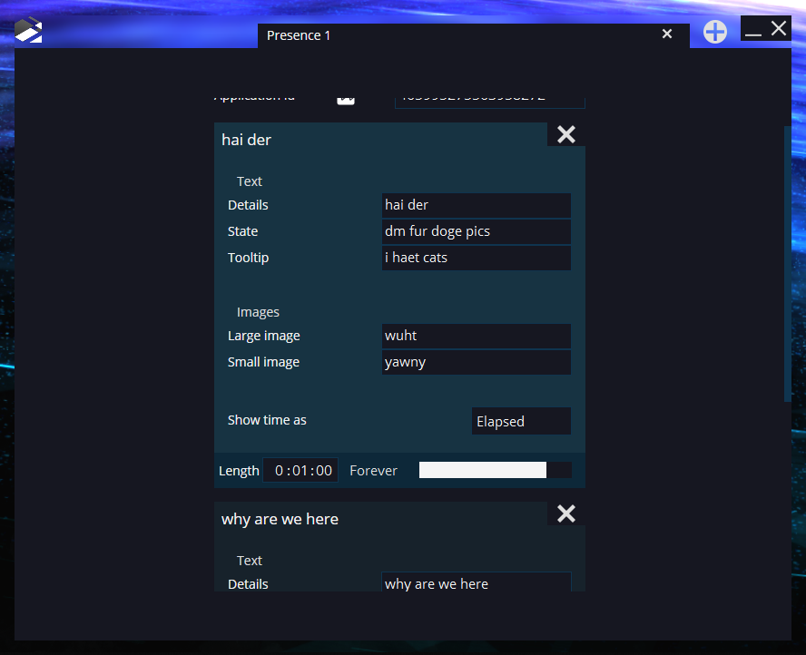
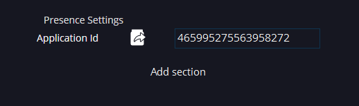

# Presence

A simple discord rich presence client, written in rust & sciter.

# A short tutorial
## Presences

Presences (presets) are persistent and managed by the tab bar at the top. You can click the plus to add a default presence, double click on the name to change it, and hit the X to delete a presence.

## Configuration

In the middle is where all the settings are. You can paste an app id by clicking the paste button, and click add section... to add a default section....

## Sections

Sections are timed pieces of a presence. You can either set one to last forever, or for a certain amount of seconds by toggling between the time input and the forever button. When one ends, the next begins. You can also click on any section to activate it. Other than that, you can set their settings using the inputs.

...And if you don't know already, you can hit X to delete a section.